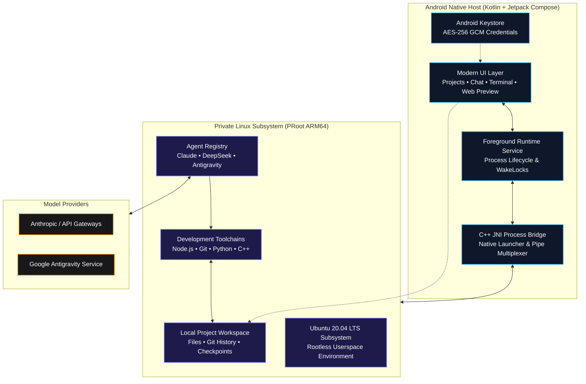

<div align="center">

  

  # Mobile Harness

  ### *The complete autonomous AI development workspace for Android.*

  **Chat with coding agents, edit projects, execute real Linux commands, and preview live web servers — all directly on your phone.**

  <br />

  [](https://github.com/sunmughan/Mobile-Harness-Extended/releases/tag/v1.0.22)
  [](#system-requirements)
  [](#system-requirements)
  [](LICENSE)
  [](https://www.youtube.com/techjarves)

  <br />

  [**Download Online APK (87.2 MiB)**](https://github.com/sunmughan/Mobile-Harness-Extended/releases/download/v1.0.22/app-online-release.apk) &nbsp;•&nbsp;
  [**Download Offline APK (847.3 MiB)**](https://github.com/sunmughan/Mobile-Harness-Extended/releases/download/v1.0.22/app-offline-release.apk) &nbsp;•&nbsp;
  [**Watch Walkthrough (3 min)**](https://youtu.be/QzAau52Z7yQ) &nbsp;•&nbsp;
  [**Quickstart Guide**](#quickstart) &nbsp;•&nbsp;
  [**Architecture**](#architecture) &nbsp;•&nbsp;
  [**Build from Source**](#developer-guides)

</div>

> [!NOTE]
> **Current development status (October 2026):** Mobile Harness **v1.0.22** (versionCode `23`) is the latest verified production release.
> 
> Major advancements in this release:
> - **Interactive Workflow Modes**: First-class **Plan**, **Build**, and **Unified** modes featuring interactive task checklists, step-by-step roadmaps, and approval gates.
> - **Collapsible Workspace Controls**: Animated `Tune` toggle button beside the chat input to collapse/expand Scratchpad and Mode Selector bars on demand, maximizing vertical conversation space.
> - **Continuous Task Attachments**: Attach up to 5 files or media items to the chat box dynamically even while an autonomous agent task is actively running.
> - **Tri-Agent Ecosystem**: Native support for **Google Antigravity CLI (`agy`)**, **Anthropic Claude Code**, and **DeepSeek Harness (`dsh`)** with guest-aware executable discovery and live environment version tracking.
> - **Skills Marketplace & Management**: Dedicated Skills manager with live version checks, GitHub main/master fallback updates, and safe tarball extraction.
> - **Built-in IDE & Offline Privacy**: Integrated full code editor with syntax highlighting, bracket matching, find/replace, symbol outline, workspace `@file` mentions, and bundled offline Privacy Policy viewer.
> - **Verified ARM64 Toolchains**: Dynamically resolved runtime bundles for Python 3.11+, Android SDK / Build Tools, and PHP 8.4 with Composer.
> - **Verified In-Place Updates**: Permanent Codeair release key signing and automated Android 34 emulator in-place upgrade verification in CI.

<br />

---

<p align="center">
  <a href="https://youtu.be/QzAau52Z7yQ" target="_blank" rel="noopener noreferrer">
    
  </a>
  <br />
  <sub>Watch the product walkthrough and demo &nbsp;|&nbsp; <i>Setting up Ubuntu, connecting Claude Code, and building an app on Android</i></sub>
</p>

---

<br />

> [!IMPORTANT]
> **Environment Security Notice**  
> Mobile Harness runs on **ARM64 Android devices** using a private userspace PRoot layer. While isolated from other apps via standard Android sandbox permissions, PRoot is not a virtualization boundary or hardened security jail. Only execute projects and dependencies you own or trust.

<br />

## Download Mobile Harness

<div align="center">
  <h3>Choose the edition that fits your setup</h3>
  <p>Both editions contain the complete Mobile Harness app and support secure in-place updates.</p>
</div>

<table>
  <tr>
    <td width="50%" valign="top" align="center">
      <h3>Online Edition</h3>
      <p><strong>91,431,815 bytes (~87.2 MiB) · Core bundled</strong></p>
      <p>Lightweight APK. Downloads verified runtime packages (Python, Android SDK, Claude, Antigravity, DeepSeek) on demand.</p>
      <a href="https://github.com/sunmughan/Mobile-Harness-Extended/releases/download/v1.0.22/app-online-release.apk">
        
      </a>
    </td>
    <td width="50%" valign="top" align="center">
      <h3>Offline Edition</h3>
      <p><strong>888,492,059 bytes (~847.3 MiB) · Everything included</strong></p>
      <p>Completely self-contained. Pre-bundles all ARM64 runtimes (Core, Python, Android, Claude, DeepSeek, Antigravity) for zero-network setup.</p>
      <a href="https://github.com/sunmughan/Mobile-Harness-Extended/releases/download/v1.0.22/app-offline-release.apk">
        
      </a>
    </td>
  </tr>
</table>

<p align="center">
  <strong>ARM64 Android 9+ · Release v1.0.22</strong><br />
  <sub>Direct APK installation · No root required · No USB or wireless ADB pairing · Permanent Codeair signature</sub>
</p>

<br />

## Capabilities

Mobile Harness unites modern **Jetpack Compose UI** with a self-contained **Ubuntu 20.04 LTS subsystem**. It gives you a desktop-class software development environment in your pocket without requiring root access, unlocked bootloaders, or external applications like Termux.

<table>
  <tr>
    <td width="50%" valign="top">
      <h3>Plan, Build & Unified Modes</h3>
      <p>Structured workflow execution: brainstorm in <b>Plan</b> mode, execute end-to-end in <b>Build</b> mode, or leverage <b>Unified</b> mode with interactive roadmaps, step checklists, and approval gates.</p>
    </td>
    <td width="50%" valign="top">
      <h3>Tri-Agent Coding Ecosystem</h3>
      <p>Native integrations with <b>Google Antigravity CLI</b>, <b>Claude Code</b>, and <b>DeepSeek Harness</b>. Guest-aware executable detection, live version refresh, and resumable sessions.</p>
    </td>
  </tr>
  <tr>
    <td width="50%" valign="top">
      <h3>Dynamic Workspace Controls</h3>
      <p>Collapsible Scratchpad and Mode Selector bars toggled on demand via an animated <b>Tune</b> button to maximize conversation viewing area. Continuous media/file attachments even while tasks run.</p>
    </td>
    <td width="50%" valign="top">
      <h3>Desktop-Class Code Editor</h3>
      <p>Built-in IDE editor with line numbers, syntax highlighting, bracket matching, find/replace, symbol outline, go-to-line, atomic saves, workspace file search, and <code>@file</code> context mentions.</p>
    </td>
  </tr>
  <tr>
    <td width="50%" valign="top">
      <h3>Skills Management & Updaters</h3>
      <p>Dedicated Skills ecosystem with automatic skill discovery, live version tracking, one-tap updates, GitHub main/master fallback extraction, and verified tarball validation.</p>
    </td>
    <td width="50%" valign="top">
      <h3>Isolated Linux Subsystem</h3>
      <p>A full Ubuntu 20.04 ARM64 userspace running inside PRoot. Includes Node.js, npm, Git, OpenSSL, curl, and essential shell tooling out of the box.</p>
    </td>
  </tr>
  <tr>
    <td width="50%" valign="top">
      <h3>Instant Web Preview</h3>
      <p>Spun up a Vite, Next.js, or Express server? Test web interfaces in real-time within a restricted, sandboxed mobile WebView with live console telemetry.</p>
    </td>
    <td width="50%" valign="top">
      <h3>Keystore Encryption & Offline Privacy</h3>
      <p>API keys encrypted via Android Keystore AES-256 GCM. Bundled offline Privacy Policy viewer. Zero remote relays, zero proxies, and no external plain-text leaks.</p>
    </td>
  </tr>
  <tr>
    <td width="50%" valign="top">
      <h3>On-Device Android Builds</h3>
      <p>Build, install, and launch Android APKs directly on your phone without USB or wireless ADB pairing.</p>
    </td>
    <td width="50%" valign="top">
      <h3>Dynamic Upstream Toolchains</h3>
      <p>Real install and update routing for Python 3.11+, Android SDK/Build-tools, PHP 8.4 with Composer, and C/C++ toolchains.</p>
    </td>
  </tr>
</table>

<br />

## Workspace Interface

<table>
  <tr>
    <th width="33%" align="center">Projects</th>
    <th width="33%" align="center">Terminal</th>
    <th width="33%" align="center">Settings</th>
  </tr>
  <tr>
    <td align="center" valign="top">
      
    </td>
    <td align="center" valign="top">
      
    </td>
    <td align="center" valign="top">
      
    </td>
  </tr>
  <tr>
    <td align="center"><sub>Create, organize, and resume isolated workspace sessions.</sub></td>
    <td align="center"><sub>Execute real Linux commands and scripts with instant output.</sub></td>
    <td align="center"><sub>Manage AI providers, installed toolchains, themes, and runtime health.</sub></td>
  </tr>
</table>

<br />

## Quickstart

Get up and running in 3 guided steps:

### 1. Download & Install
Download the latest signed release APK from [GitHub Releases](https://github.com/sunmughan/Mobile-Harness-Extended/releases/latest).

```text
Target Architecture : ARM64 (arm64-v8a)
Package Version     : v1.0.22
Minimum OS Level    : Android 9.0 (API 28)
```

### 2. Guided Bootstrap (~10 Minutes)
Launch the application and follow the interactive setup wizard:

<table>
  <tr>
    <th width="33%" align="center">1 · System Readiness</th>
    <th width="33%" align="center">2 · Toolchains</th>
    <th width="33%" align="center">3 · AI Provider</th>
  </tr>
  <tr>
    <td align="center" valign="top">
      
    </td>
    <td align="center" valign="top">
      
    </td>
    <td align="center" valign="top">
      
    </td>
  </tr>
  <tr>
    <td align="center"><sub>Verifies device storage, CPU architecture, and background service permissions.</sub></td>
    <td align="center"><sub>Select core Ubuntu runtime and optional development stacks.</sub></td>
    <td align="center"><sub>Securely store your API keys in Android Keystore.</sub></td>
  </tr>
</table>

### 3. Create & Build
1. Tap **New Project** or launch an instant **Quick Project**.
2. Select your desired workflow mode: **Plan**, **Build**, or **Unified**.
3. Open the **AI Workspace**, add files or media attachments, and collaborate with your agent.
4. Watch the agent inspect files, outline roadmaps, execute builds, and launch local web previews.

<br />

## Model Providers & Autonomous Agents

Mobile Harness features native multi-agent drivers with isolated environments, credential handling, and persistent project conversations:

### Coding Agents

| Agent | Authentication | Tool Execution | Environment & Versioning |
| :--- | :--- | :--- | :--- |
| **Google Antigravity (`agy`)** | Official Google OAuth in system browser | Native CLI tool-calling & bash execution | Dedicated PRoot bridge, symlink discovery, effort control & slash commands |
| **Claude Code** | Claude account or Anthropic API key | Native file & shell tool-calling | Included in Core bundle with live version tracking & update controls |
| **DeepSeek Harness (`dsh`)** | DeepSeek API key / Anthropic-compatible | Custom tool-calling driver | Isolated DSH bridge, model switcher & on-demand runtime installation |

### Skills Management Ecosystem

Mobile Harness features an extensible **Skills Management** interface:
- **Automatic Discovery**: Discovers installed skills across the Ubuntu PRoot rootfs and user configuration directories.
- **One-Tap Updates**: Checks for upstream skill updates with fallback from GitHub `main` to `master` branches.
- **Safe Tarball Extraction**: Securely verifies, downloads, and unpacks skill archives into the active runtime without breaking customizations.

### Connecting Antigravity CLI

For Antigravity, select **Antigravity CLI** in the Agents screen, install it, and tap **Sign in with Google**. Mobile Harness starts the official CLI login, opens the freshly generated Google URL in the system browser, and sends the returned one-time code back to that waiting process. The app does not embed Google login in a WebView and does not construct its own OAuth request.

> [!WARNING]
> Antigravity tasks currently launch with `--dangerously-skip-permissions`. This gives the official agent permission to run tools without individual PocketDev approval prompts. Use it only with projects and prompts you trust. Account quotas and service limits still apply; signing in does not provide unlimited usage.

### Android On-Device Builds

When Android is selected during onboarding, Mobile Harness installs that complete toolchain into its private Ubuntu environment. Android projects can then be built with the workspace play button. The resulting debug APK is passed directly to Android's system package installer and launched after installation; USB debugging, wireless debugging, an ADB port, and a pairing code are not required. Android still requires the user to allow installs from Mobile Harness and confirm each installation.

<br />

## Architecture

Mobile Harness bridges native Android Jetpack Compose to an isolated PRoot Linux execution layer via an optimized C++ JNI bridge:



### Core Runtime Components
* **Base Environment**: Ubuntu 20.04 ARM64 verified rootfs
* **Agent Engine**: Registry-selected, isolated drivers for Claude Code, DeepSeek Harness, and the official Antigravity CLI
* **Native Tooling**: Node.js LTS, npm, Git, OpenSSL, curl, and GNU coreutils
* **Process Virtualization**: PRoot user-space architecture emulation with zero kernel modifications

<br />

## System Requirements

| Metric | Minimum Specification | Recommended Specification |
| :--- | :--- | :--- |
| **Operating System** | Android 9.0 (API level 28) | Android 13.0+ (API level 33+) |
| **CPU Architecture** | 64-bit ARM (`arm64-v8a`) | High-performance 8-Core ARM64 (Snapdragon 8 Gen 1+ / Dimensity) |
| **RAM** | 4 GB | 8 GB or more |
| **Free Storage** | 2.5 GB (Base Runtime) | 8.0 GB+ (For multi-language toolchains and build caches) |
| **Network** | Stable connection for setup & API | High-speed Wi-Fi during initial rootfs provisioning |

<br />

---

## Developer Guides

<details>
<summary><b>Building from source (Android Studio & NDK)</b></summary>

<br />

### Prerequisites
* **Android Studio**: Ladybug / Hedgehog or newer
* **Android SDK**: API Level 36 (`compileSdk 36`)
* **Java Development Kit**: JDK 17 (Eclipse Temurin or OpenJDK)
* **Android NDK**: `26.1.10909125`
* **CMake**: `3.22.1`

### Clone & Build Debug APK
```bash
# Clone the repository
git clone https://github.com/sunmughan/Mobile-Harness-Extended.git
cd Mobile-Harness-Extended

# Build the standard ARM64 debug binary
./gradlew assembleDebug

# Deploy directly to a connected test device
adb install -r app/build/outputs/apk/debug/app-debug.apk
```

### Quality Assurance & Testing
```bash
# Run unit tests
./gradlew testDebugUnitTest

# Run static analysis linter
./gradlew lintDebug
```

### Target Profiles
* **Direct Sideload APK** (Default): Targets API 28 to preserve proven userspace execution paths under Android 10-14.
* **Google Play Compliance Build**:
  ```bash
  ./gradlew -PplayBuild=true assembleDebug
  ```
  Refer to the [Google Play Release Checklist](docs/PLAY_STORE_CHECKLIST.md) for signing and permission policies.

</details>

<details>
<summary><b>Optional toolchains and development stacks</b></summary>

<br />

Mobile Harness allows downloading optional developer packs on demand to conserve space:

* **Python Suite**: Python 3.11+, pip, virtualenv, and essential scientific C-extensions via verified upstream ARM64 bundles.
* **Android & JVM**: OpenJDK 17 headless runtime, Android SDK Build Tools, and Gradle with direct on-device APK installation.
* **PHP Development**: PHP 8.4 runtime via Ondřej PHP PPA for Ubuntu 20.04 ARM64, official latest-stable Composer, and database extensions.
* **C / C++ Compiler Suite**: GCC/G++, Clang, Make, and CMake for native tool compilation.

> *Note: Kernel-level virtualization technologies such as Docker, KVM, systemd services, and nested hardware emulators are not supported under PRoot.*

</details>

<details>
<summary><b>Repository directory structure</b></summary>

<br />

```text
Mobile-Harness/
├── app/src/main/
│   ├── java/com/jarves/mh/
│   │   ├── data/       # Preferences, Keystore AES encryption, SQLite persistence
│   │   ├── model/      # Data entities: Projects, Chats, Files, Tool calls
│   │   ├── runtime/    # PRoot installer, C++ agent bridge, foreground services
│   │   └── ui/         # Jetpack Compose screens, Material 3 theme, ViewModels
│   ├── cpp/            # Native C++ launcher, pseudo-terminal pipe handler
│   ├── assets/         # Verified rootfs checksums, licenses, base configuration
│   └── res/            # Android icons, XML drawables, vector assets
├── fastlane/           # Play Store metadata, graphics, and release automation
└── docs/               # In-depth architectural notes & Play Store review guides
```

</details>

<details>
<summary><b>Security model and data privacy</b></summary>

<br />

* **Zero Cloud Intermediaries**: Mobile Harness connects your device directly to your chosen AI endpoint. No intermediate relays or telemetry servers collect your prompts or code.
* **In-App Offline Privacy Policy**: Access the complete, bundled [Privacy Policy](PRIVACY.md) directly within the app without needing external network access.
* **Scoped Storage**: Project imports and exports utilize Android's official Storage Access Framework (SAF) instead of broad shared storage access.
* **Cryptographic Verification**: Root filesystem archives, CLI packages, and runtime bundles are SHA-256 verified prior to extraction.
* **Hardware-Backed Encrypted Secrets**: API tokens and credentials are encrypted via Android Keystore AES-256 GCM.
* **Permanent Release Signing**: Production APKs are signed with the official Codeair Software Solutions release key and verified in CI.

- ARM64 phones only
- No hardened isolation for hostile code
- Terminal input/output currently uses a process bridge rather than a complete PTY emulator; full-screen interactive programs may render incorrectly
- Background tasks are subject to Android process and battery policies
- Custom providers may lack Claude-compatible thinking, tool use, token counting, or streaming behavior
- Large builds can be slow and memory-intensive under PRoot
- Runtime installation requires a substantial download and free storage
- Project-specific Android libraries may still be downloaded by Gradle when they are not already in the bundled Maven cache

Read our complete [Privacy Policy](PRIVACY.md).

</details>

Mobile Harness is currently intended for signed direct APK distribution and private testing. Its Android-project workflow requests permission to submit user-built APKs to Android's package installer, which requires a dedicated Google Play policy declaration and approval if distributed through Play.

<br />

## Current Limitations

* **Architecture**: Exclusively supports 64-bit ARM (`arm64-v8a`) hardware.
* **Process Isolation**: PRoot maps file systems and IDs in user space; it is not a cryptographically hardened container or VM.
* **Terminal Emulation**: The process bridge handles standard CLI workflows and REPLs; specialized ncurses applications may experience minor layout artifacts.
* **OS Process Management**: Heavy compilation workloads may be throttled if Android applies aggressive battery optimization. It is recommended to exempt Mobile Harness from battery optimization in device settings.

<br />

## Legal & Trademarks

* Mobile Harness is an independent open-source project and is not affiliated with, endorsed by, or sponsored by Anthropic.
* **Claude** and **Claude Code** are trademarks of Anthropic, PBC. Claude Code CLI is downloaded directly from Anthropic's official distribution endpoints during setup and remains governed by Anthropic's license terms.
* Ubuntu, Android, Kotlin, Node.js, Git, and other registered trademarks belong to their respective copyright holders.
* Third-party open-source licenses are compiled in [`app/src/main/assets/licenses`](app/src/main/assets/licenses).

<br />

## License

This project is licensed under the [MIT License](LICENSE). Third-party runtime binaries and packages remain governed by their respective upstream licenses.

<br />

---

<div align="center">
  <sub>Crafted for developers who want a serious, uncompromised development environment wherever they go.</sub>
  <br />
  <sub>Copyright © 2026 Tech Jarves. All rights reserved.</sub>
</div>

## Crash diagnostics

Every app process initializes a dependency-light crash/startup logger before the launcher activity. It writes synchronous diagnostics to `crash.log` in the app's private internal files directory and mirrors the same file to the app-specific external files directory when available.

- Internal: `<app internal files>/crash.log`
- Retrieval mirror: `Android/data/com.jarves.mh/files/crash.log`
- Captures startup checkpoints, uncaught Java/Kotlin exceptions, stack traces, app/build/device metadata, and logger file paths.
- The log is capped at 8 MiB and retains the newest 4 MiB when rotation is required.

For a startup crash, launch the app once with the diagnostic build, reproduce the crash, then upload `crash.log` here for root-cause analysis.

<!-- Release pipeline: permanent Codeair signing configured for v1.0.13. -->

<!-- Release pipeline retry: permanent Codeair signing key refreshed for v1.0.13. -->
